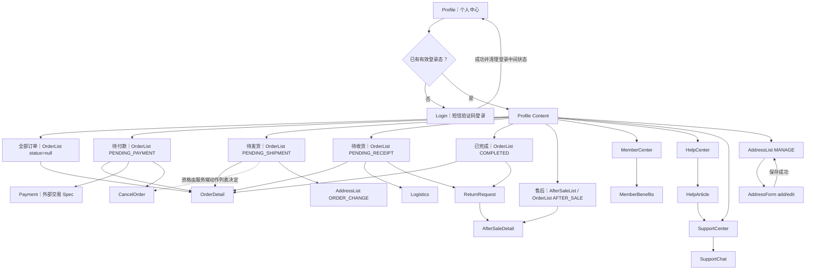
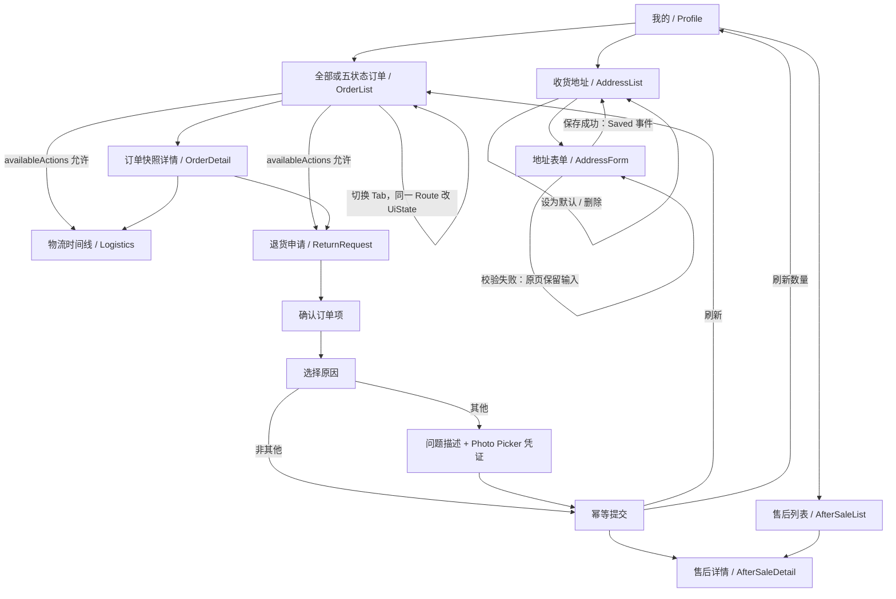
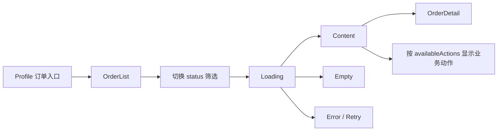
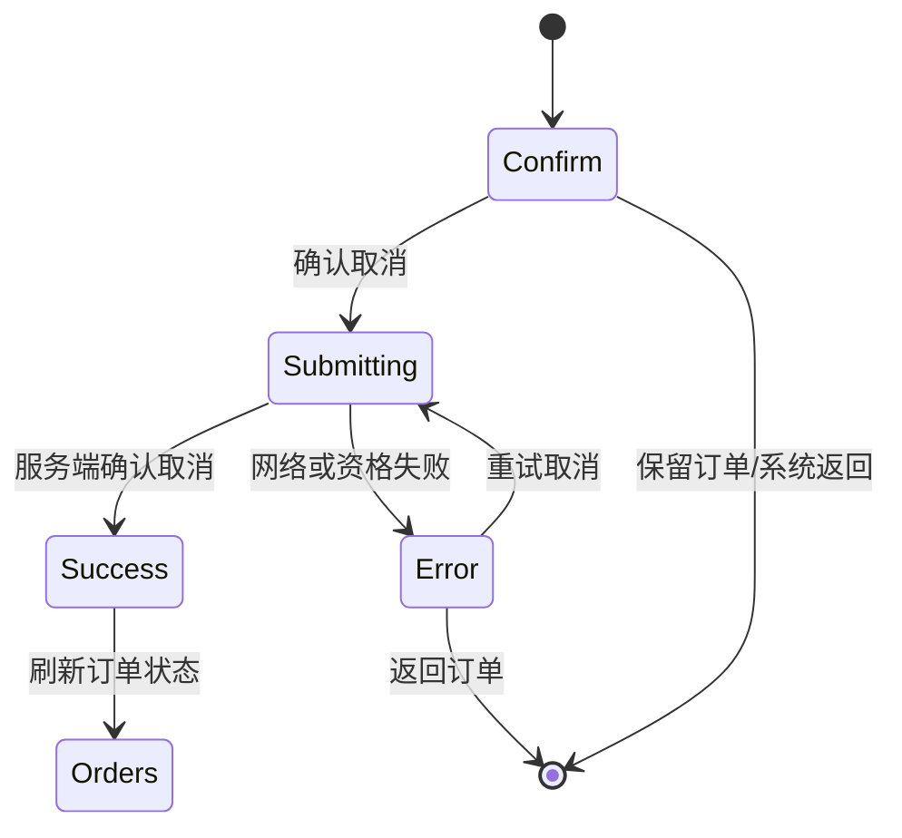
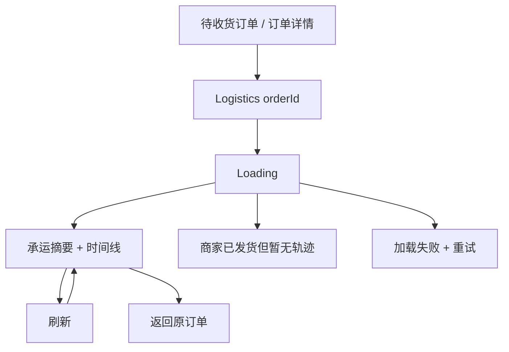
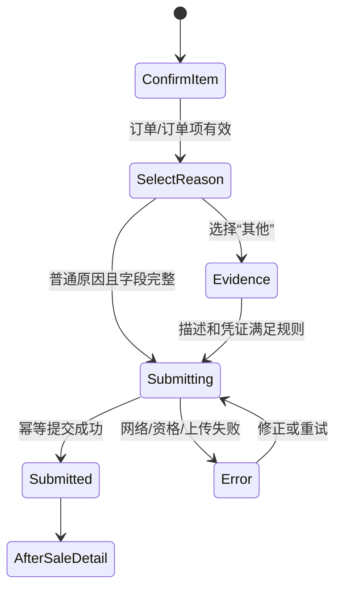
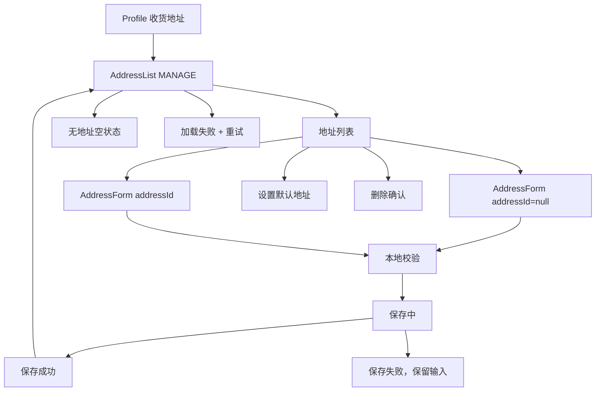
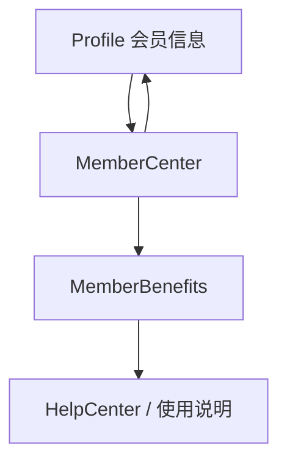
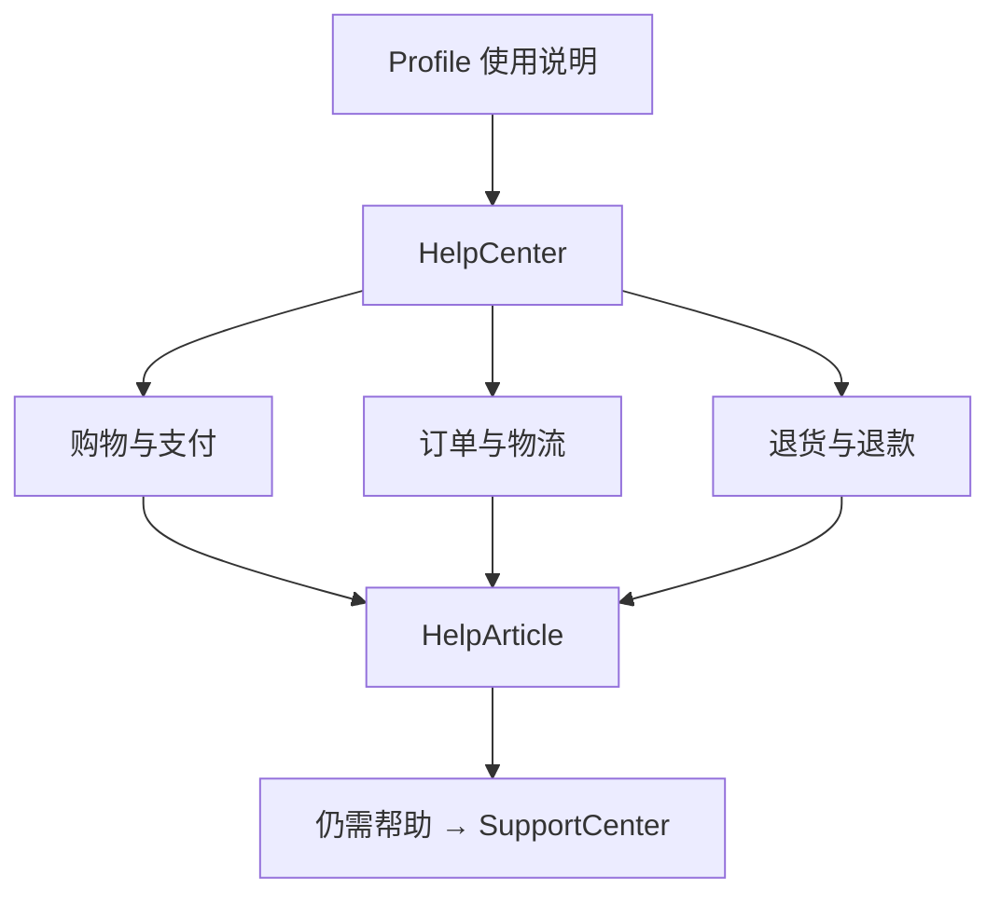
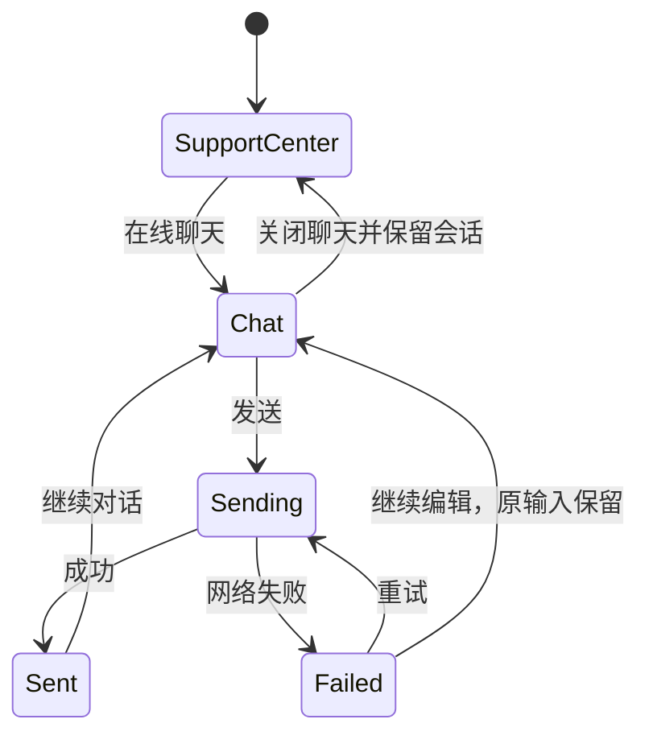

# SYDRA 个人中心下游 Wireflow 与开发 Spec

更新时间：2026-08-10

工作树：`/Users/zhouxianliang/Documents/ChatGPT/衣服app`

分支：`main`

状态：项目拥有者已授权按参考图直接完成订单、物流、退货售后和地址管理。当前已完成可运行的本地 `LocalPrototype` 闭环；真实后端、支付、退款和上传服务仍未接入。

## 1. 文档目标

本文把个人主页中的所有入口转换成可开发、可测试、可人工验收的 Android Wireflow，并明确：

- 页面入口、用户动作、状态变化、成功目标和返回目标。
- Loading、Content、Empty、Error、提交中和成功等状态。
- Route、ViewModel、Repository、领域模型和数据边界。
- V1/V2 参考图能证明的内容、冲突和缺失规格。
- 小步开发顺序、每关验收路径和完成标准。

本文不代表真实后端、登录、支付、退款、物流或客服服务已经接入。

## 2. 参考证据与采用顺序

### 2.1 事实优先级

1. 项目拥有者已确认的产品决策和当前 Wireflow。
2. `sydra-ai-material-pack/PRODUCT_FLOW.md` 的 Route 与状态矩阵。
3. Figma V2 状态图，用于补充 V1 缺少的状态。
4. V1 页面图，用于页面结构和视觉基线。
5. `project-analysis.md` 和 `learning-roadmap.md` 的架构、领域和交付边界。

### 2.2 页面证据映射

| 功能 | V1 参考 | V2 补充 | 采用方式 |
|---|---|---|---|
| 个人主页 | `14-个人中心（登录 – 14）`、微调稿 `登录 – 24` | 无 | 当前 `ProfileScreen` 的视觉基线 |
| 订单列表 | `15` 至 `19` | 无 | 同一列表页面按状态筛选，不复制五个页面 |
| 订单详情 | `20-订单详情` | 无 | 商品、金额、订单号、交易方式和时间 |
| 取消订单 | V1 待发货菜单出现入口 | `94:1194`、`94:1234`、`94:1269` | 确认、提交、成功、失败；适用状态仍需业务确认 |
| 物流 | `27-物流详情` | 无 | 物流摘要、时间线和收件信息 |
| 退货申请 | `22` 至 `24` | 无 | 订单号、原因、其他原因与凭证 |
| 售后状态 | `19`、`21` | `95:1367`、`95:1402`、`96:1349`、`96:1384` | 已提交、退款中、完成、拒绝 |
| 会员 | 个人主页卡片入口 | `98:1495`、`98:1542` | 会员中心、权益说明，只读原型 |
| 帮助 | 个人主页使用说明入口 | `98:1589`、`98:1636` | 帮助分类和文章详情 |
| 客服 | 个人主页客户服务入口 | `101:1596`、`101:1643`、`104:1816` | 客服中心、发送失败保留内容、重试成功 |
| 地址 | `25`、`26` | `101:1758`、`102:1730`、`102:1768` | 列表、校验错误、保存中、保存成功 |

### 2.3 平台外壳排除

- 不实现参考图中的 iOS 状态栏、Home Indicator 和微信小程序胶囊。
- Android 使用系统 Insets、系统返回和原生安全区域。
- 参考图中的“更多”只有在业务动作明确时才实现为 Android 菜单或底部面板。

## 3. 已确认产品规则

- 个人主页是底部四个顶级入口之一。
- 当前已确认返回目标：从其他顶级页面进入“我的”后，系统返回回到进入前的顶级页面。
- 订单领域保留五种状态：待付款、待发货、待收货、已完成、售后。
- 参考图中的“已发货”映射到领域状态“待收货”，不新增第六种状态。
- 订单列表使用同一 Route，根据筛选状态显示内容。
- Android 原生登录方向为短信验证码；不照搬小程序微信手机号快捷登录。
- 会员、帮助、客服、地址保存和退款等 V2 页面目前只证明本地 UI 状态，不证明真实服务已存在。
- 未接真实服务时必须使用明确命名的 `LocalPrototype`/`Fake` 实现，不伪造线上成功。

## 4. 当前实现基线

### 4.1 已完成

- `feature/profile/ProfileScreen.kt` 已实现个人主页视觉和入口。
- `SydraRoute.Profile` 已接入 `SydraNavHost`。
- 个人页的全部订单、五状态订单、售后和收货地址入口已连接到真实 Route。
- `SydraRoute.kt` 已存在：`OrderList`、`OrderDetail`、`Logistics`、`AfterSaleList`、`AfterSaleDetail`、`ReturnRequest`、`AddressList`、`AddressForm`。
- 已新增可替换 `SydraApi` 契约、API 错误模型、各业务 DTO、领域 Model、DTO→Model Mapper 和 `LocalPrototypeApi`。
- `LocalPrototypeApi` 已覆盖五种订单状态、取消成功/资格失败、物流轨迹、售后提交、地址校验/默认值/删除限制、会员、帮助和客服发送失败重试。
- `ProfileViewModel` 和 `ProfileUiState` 已接入个人页；用户名、会员等级来自 API Model，加载失败显示可重试状态。
- `feature/order` 已实现单 Route 五状态订单列表、订单快照详情、取消确认和操作资格驱动按钮。
- `feature/logistics` 已实现物流摘要、轨迹时间线、脱敏收件信息和刷新。
- `feature/aftersale` 已实现售后列表/详情和退货三步状态机；“其他”原因接入 Android Photo Picker 本地凭证选择。
- `feature/address` 已实现地址列表、新增/编辑、默认地址、删除确认和字段校验。
- `SydraCommerceRepository` 已把 Order/Logistics/AfterSale/Address 的 UI 数据链统一为 `UI → ViewModel → Repository → SydraApi → DTO → Model`。

### 4.2 尚未完成

- Profile 真实登录门禁和网络数据源；当前已完成本地 Profile Loading/Content/Error 状态。
- 会员、帮助和客服的下游页面仍未实现；本次授权范围是订单、物流、售后和地址。
- 订单、地址和售后已有 ViewModel/Repository，但当前数据源是本地原型，不是生产网络实现。
- 真实 API、数据库、上传、退款、物流、客服与支付。

## 5. 总 Wireflow



### 5.1 2026-08-10 已落地交易闭环



顶部返回和 Android 系统返回统一使用 Navigation back stack；退货成功会移除提交页，直接进入售后详情，不会返回“提交中”状态。

## 6. Profile 入口 Wireflow

### 6.1 进入与身份状态

| 项目 | 规格 |
|---|---|
| 入口 | 底部导航“我的” |
| Guest | 显示登录引导；点击登录进入短信验证码 Login，并携带返回目标 `Profile` |
| Loading | 用户摘要和入口区域使用稳定骨架，不显示伪造用户名或会员等级 |
| Content | 显示头像/品牌占位、用户名称、会员信息、订单数量摘要和功能入口 |
| Error | 保留个人页骨架，显示重试；订单/地址等需要鉴权的入口禁用并说明原因 |
| 成功目标 | 用户能看到真实或明确标记的本地原型数据，并进入目标流程 |
| 返回目标 | 按已确认规则回到进入前的顶级页面 |

### 6.2 入口到 Route 的唯一映射

| 个人页控件 | Route / Action |
|---|---|
| 全部订单 | `OrderList(status = null)` |
| 待付款 | `OrderList(PENDING_PAYMENT)` |
| 待发货 | `OrderList(PENDING_SHIPMENT)` |
| 待收货 | `OrderList(PENDING_RECEIPT)` |
| 已完成 | `OrderList(COMPLETED)` |
| 售后 | 优先 `AfterSaleList`；若产品坚持共用订单列表，则使用 `OrderList(AFTER_SALE)`，二选一后固定 |
| 会员信息 | `MemberCenter` |
| 使用说明 | `HelpCenter` |
| 客户服务 | `SupportCenter` |
| 收货地址 | 当前使用 `AddressList`，其个人页入口语义固定为 `MANAGE`；被结算/改址复用时再显式增加 mode |

## 7. 订单 Wireflow

### 7.1 订单列表



关键规则：

- Route 只传 `OrderStatus?`，列表数据由 `OrderViewModel` 从 Repository 获取。
- Tab 切换是同页状态变化，不为五种状态创建五个 Composable。
- “更多”菜单只显示后端/本地原型明确返回的 `availableActions`。
- 空状态文案必须对应当前筛选，例如“暂无待收货订单”。
- 请求失败保留当前 Tab，重试不返回 Profile。
- 从详情返回时恢复原 Tab、滚动位置和分页内容。

### 7.2 状态与动作矩阵

| 状态 | 必须动作 | 条件动作 | 禁止擅自推断 |
|---|---|---|---|
| 待付款 | 查看详情、付款 | 取消订单 | 超时关闭时间、库存释放时间 |
| 待发货 | 查看详情、客服 | 修改地址、取消订单 | 是否已出库、是否允许取消/改址 |
| 待收货 | 查看详情、查看物流、客服 | 退货/售后、确认收货 | 确认收货规则、退货时限 |
| 已完成 | 查看详情 | 售后 | 售后有效期、可退商品范围 |
| 售后 | 查看售后详情 | 补充凭证、联系客服 | 退款到账时间、审核 SLA |

资格判断不得只写在 UI：Repository 返回 `availableActions`，服务端在提交时再次校验。

### 7.3 订单详情

| 项目 | 规格 |
|---|---|
| 入口 | 订单卡“查看详情”或点击订单卡 |
| Loading | 订单详情骨架 |
| Content | 商品快照、数量/尺码、金额明细、订单号、交易方式、创建/付款时间、地址快照 |
| Error | `ORDER_NOT_FOUND`、网络失败、未授权；显示可恢复动作 |
| 动作 | 根据 `availableActions` 显示付款、取消、物流、售后、客服等 |
| 返回 | 回到订单列表原筛选和原滚动位置 |

订单详情必须显示订单快照，不读取可能已经变化的当前商品名称、价格或地址。

### 7.4 取消订单



- 危险操作必须二次确认。
- 提交时按钮禁用，使用幂等键防止重复请求。
- 成功后清除取消确认页，不允许返回“提交中”。
- 失败后订单状态保持原值，显示服务端原因并允许刷新。
- V1 与 V2 对可取消状态存在冲突，因此首版 UI 依赖 `availableActions`，不硬编码“待发货一定可取消”。

## 8. 物流 Wireflow



字段最低要求：承运商、脱敏运单号、当前状态、节点时间、地点、描述、收件人脱敏信息。真实承运商 API 未提供，正式接入前必须确认数据源和刷新频率。

## 9. 退货与售后 Wireflow

### 9.1 退货申请

现有类型安全 Route 保留为 `ReturnRequest(orderId, itemId)`；参考图中的三个步骤使用同一页面状态机，避免把表单数据拆散到多个返回栈页面。



步骤与状态：

| 步骤 | 输入/动作 | 校验 | 返回行为 |
|---|---|---|---|
| 确认订单项 | 订单号或由订单详情自动带入 | 订单、订单项非空且属于当前用户 | 返回订单，不创建申请 |
| 选择原因 | 质量问题、不想要、缺货/错发、其他 | 未选择时提交禁用 | 返回确认步骤并保留输入 |
| 其他原因/凭证 | 问题描述、Photo Picker 图片/视频 | 规格待确认；未满足时不提交 | 返回原因并保留草稿 |
| 提交中 | 上传凭证并创建申请 | 幂等键、资格二次校验 | 阻止重复点击 |
| 提交成功 | 显示申请编号和待审核状态 | 刷新订单/售后列表 | 进入售后详情，不回提交中 |

### 9.2 售后列表和详情

售后领域状态：

| 状态 | 用户可见目标 | 允许动作 |
|---|---|---|
| Submitted / 待审核 | 显示申请编号、提交时间和等待审核 | 查看详情、联系客服 |
| Refunding / 退款中 | 显示原路退回和处理提示 | 刷新状态、查看异常结果 |
| Completed / 已完成 | 显示金额、完成时间和到账渠道说明 | 查看退款记录、返回订单 |
| Rejected / 未通过 | 显示明确原因 | 补充凭证（若允许）、联系客服 |

返回规则：售后详情返回售后列表原位置；补充凭证返回详情并刷新；退款完成后不能返回“退款中”的提交页面。

## 10. 地址管理 Wireflow

### 10.1 管理模式



### 10.2 表单字段和校验

| 字段 | 首版校验 |
|---|---|
| 联系人 | 必填；长度和字符规则由产品/API 契约确认 |
| 手机号 | 中国大陆手机号首版为 11 位数字；国际化前不可写死为全球规则 |
| 省/市/区/街道 | 必填；行政区数据源待确认 |
| 详细地址 | 必填；不得记录到日志 |
| 门牌号 | 是否独立必填需产品确认 |
| 标签 | 默认/公司/商家或自由文本，最终词表待确认 |
| 默认地址 | 列表只能有一个默认地址；切换失败保持原默认值 |

- 删除默认地址的限制、订单使用中地址能否删除仍需确认。
- 保存失败必须保留全部输入和开关状态。
- 保存成功返回来源：Profile 管理模式回地址列表；结算/改址模式回调用页面并带回选择结果。

## 11. 会员、帮助与客服 Wireflow

### 11.1 会员



- 会员页只展示服务端真实返回或明确标记的本地原型信息。
- 不把当前 `T5` 演示值描述为真实等级。
- 权益、使用条件和有效期没有正式业务文案时显示“规格待补充”，不承诺折扣或服务。

### 11.2 帮助与文章



- 内容可以先用版本化本地资源，但不能写虚假的政策、时效或联系方式。
- 文章返回帮助中心并保留分类；从文章进入客服后返回文章。

### 11.3 客服和聊天



- 不展示未经确认的客服电话。
- 发送失败保留输入；重试不能重复显示两条用户消息。
- 关闭聊天保留当前会话；清除会话需要单独确认。
- 真实消息同步、人工接入、离线消息和会话历史均为后端依赖。

## 12. Route 设计

### 12.1 现有 Route 继续使用

- `SydraRoute.Profile`
- `SydraRoute.OrderList(status: OrderStatus?)`
- `SydraRoute.OrderDetail(orderId: String)`
- `SydraRoute.Logistics(orderId: String)`
- `SydraRoute.AfterSaleList`
- `SydraRoute.AfterSaleDetail(requestId: String)`
- `SydraRoute.ReturnRequest(orderId: String, itemId: String)`
- `SydraRoute.AddressList`
- `SydraRoute.AddressForm(addressId: String?)`

### 12.2 计划新增 Route

- `CancelOrder(orderId: String)`
- `MemberCenter`
- `MemberBenefits`
- `HelpCenter(categoryId: String? = null)`
- `HelpArticle(articleId: String)`
- `SupportCenter`
- `SupportChat(conversationId: String? = null)`

地址被结算或订单改址复用时，再把 `AddressList` 扩展为带 `mode` 和必要来源标识的类型安全 Route；本轮 Profile 管理模式不提前引入无用参数。

Route 只传稳定领域 ID 和枚举，不传整个对象、手机号、地址文本或 UI 状态。

## 13. 架构与数据流

### 13.1 Feature 目录计划

```text
feature/
├── profile/
│   ├── ProfileScreen.kt
│   ├── ProfileViewModel.kt
│   └── ProfileUiState.kt
├── order/
│   ├── OrderListScreen.kt
│   ├── OrderDetailScreen.kt
│   ├── CancelOrderScreen.kt
│   ├── OrderViewModel.kt
│   └── OrderUiState.kt
├── logistics/
│   ├── LogisticsScreen.kt
│   └── LogisticsViewModel.kt
├── aftersale/
│   ├── ReturnRequestScreen.kt
│   ├── AfterSaleListScreen.kt
│   ├── AfterSaleDetailScreen.kt
│   └── AfterSaleViewModel.kt
├── address/
│   ├── AddressListScreen.kt
│   ├── AddressFormScreen.kt
│   └── AddressViewModel.kt
└── support/
    ├── MemberScreen.kt
    ├── HelpScreen.kt
    ├── SupportScreen.kt
    └── SupportViewModel.kt
```

仍保持单 app module；没有构建时间或团队边界证据时不拆 Gradle 多模块。

### 13.2 单向数据流

```text
UI → UserAction → ViewModel → Repository → API / LocalPrototypeDataSource
↑                         ↓
└──────── UiState / Event ─┘
```

- ViewModel 使用 `StateFlow<UiState>` 暴露业务状态。
- Snackbar、菜单展开等短暂局部状态留在 Compose。
- 订单、地址、售后和客服消息由 Repository 维护一致事实。
- ViewModel 不持有 `NavController`；页面通过事件回调请求导航。

### 13.3 最低领域模型

| 模型 | 关键字段 |
|---|---|
| UserSummary | id、displayName、avatarUrl、memberLevel |
| Order | id、displayNo、status、items、amounts、addressSnapshot、availableActions、timestamps |
| OrderItemSnapshot | itemId、sku、title、imageUrl、size、quantity、unitPrice |
| AddressSnapshot | recipient、maskedPhone、region、detail |
| LogisticsEvent | id、occurredAt、location、description、isCurrent |
| AfterSaleRequest | id、orderId、orderItemId、reason、description、evidence、status、timeline |
| Address | id、recipient、phone、region、detail、tag、isDefault |
| HelpArticle | id、categoryId、title、version、content |
| SupportConversation | id、messages、sendState、updatedAt |

## 14. Repository 与接口边界

建议契约：

- `ProfileRepository.observeProfile()`
- `OrderRepository.observeOrders(status)`
- `OrderRepository.getOrder(orderId)`
- `OrderRepository.cancelOrder(orderId, idempotencyKey)`
- `LogisticsRepository.getLogistics(orderId)`
- `AfterSaleRepository.submit(request, idempotencyKey)`
- `AfterSaleRepository.observeRequests()`
- `AddressRepository.observeAddresses()`
- `AddressRepository.saveAddress(address, idempotencyKey)`
- `AddressRepository.setDefault(addressId)`
- `SupportRepository.sendMessage(conversationId, clientMessageId, text)`

正式接入前必须补齐：OpenAPI/JSON Schema、错误模型、鉴权、分页、幂等、上传协议、测试环境和服务端状态迁移规则。

## 15. 开发计划

原计划用于逐关开发；项目拥有者已于 2026-08-10 明确授权订单、物流、售后和地址作为一个完整批次直接实现。

### 第 0 关：冻结 Route、状态和本地契约（已完成）

- 目标：把本文 API 契约、DTO、领域 Model、Mapper 和 LocalPrototype 数据源落到代码，不做完整页面。
- 文件：`data/api/`、`data/dto/`、`data/mapper/`、`data/local/LocalPrototypeApi.kt`、`domain/model/`。
- 验收：API/DTO/Model 编译通过；本地数据可覆盖五订单状态、空和错误状态，地址和客服具备可恢复错误。
- 门禁：确认“售后”入口使用独立 `AfterSaleList`，以及取消订单适用状态。

### 第 1 关：Profile 本地状态与本批入口导航（LocalPrototype 已完成）

- 目标：移除订单、售后和地址入口的“即将开放” Snackbar，接入 LocalPrototype Loading/Content/Error 和真实 Route 回调。
- 验收路径：`首页 → 我的 → 全部/五状态订单、售后、收货地址 → 到达正确目标页 → 返回个人页`。
- 通过标准：五订单状态映射准确；售后使用独立 `AfterSaleList`；返回后个人页不丢状态。Guest 短信登录门禁留待真实鉴权阶段。

### 第 2 关：订单列表五状态（LocalPrototype 已完成）

- 目标：完成单 Route、多状态筛选的订单列表。
- 验收路径：`我的 → 全部订单/任一状态 → 切换状态 → 打开订单 → 返回`。
- 通过标准：Loading、Content、Empty、Error 全覆盖；返回恢复原 Tab/滚动；操作按钮来自 `availableActions`。

### 第 3 关：订单详情与物流（LocalPrototype 已完成）

- 目标：实现订单快照详情和物流时间线。
- 验收路径：`待收货 → 查看详情 → 查看物流 → 刷新 → 返回订单详情 → 返回原列表`。
- 通过标准：空轨迹和错误可恢复；敏感地址/手机号脱敏；订单快照不随当前商品变化。

### 第 4 关：取消订单（LocalPrototype 已完成）

- 目标：实现二次确认、提交中、成功和失败重试。
- 验收路径：`允许取消的订单 → 取消 → 保留订单/确认取消 → 成功或失败重试`。
- 通过标准：重复点击只提交一次；成功刷新列表；失败不改变原状态。

### 第 5 关：地址列表与表单（LocalPrototype 已完成）

- 目标：完成 Profile 的地址管理闭环。
- 验收路径：`我的 → 收货地址 → 空态/列表 → 新增或编辑 → 校验失败 → 保存中 → 保存成功 → 返回列表`。
- 通过标准：保存失败保留输入；默认地址唯一；系统返回与顶部返回一致。

### 第 6 关：退货申请和售后状态（LocalPrototype 已完成）

- 目标：完成退货三步状态机、凭证选择、本地上传替身和售后列表/详情。
- 验收路径：`待收货/已完成 → 退货 → 选择原因 → 其他原因与凭证 → 提交 → 待审核 → 退款中/完成/拒绝`。
- 通过标准：不符合条件不能提交；草稿不丢失；失败可重试；状态与订单列表一致。
- 门禁：确认凭证格式/数量/大小、售后时限和退款规则。

### 第 7 关：会员、帮助和客服

- 目标：实现只读会员/帮助内容和可恢复的本地客服聊天状态。
- 验收路径：`我的 → 会员/使用说明/客户服务 → 文章 → 在线聊天 → 发送失败 → 重试成功 → 返回`。
- 通过标准：不显示虚假权益/电话；失败保留输入；重试不产生重复消息。

### 第 8 关：真实后端联调与可靠性

- 目标：用生产数据源替换 LocalPrototype，不改变 UI/Repository 契约。
- 内容：鉴权、分页、幂等、上传、错误映射、缓存、离线恢复、日志脱敏、监控。
- 通过标准：端到端测试环境完成订单、物流、地址和售后回归；无密钥和敏感数据进入仓库或日志。

## 16. 测试计划

### 16.1 单元测试

- Profile 入口到 Route 的十项映射。
- 五订单状态的筛选、空态和 `availableActions`。
- 取消订单幂等与失败恢复。
- 退货步骤校验、草稿恢复和状态迁移。
- 地址表单校验、默认地址唯一性和保存失败保留输入。
- 客服失败重试不重复消息。

### 16.2 Compose UI / Navigation 测试

- 个人页所有入口可点击且触控范围至少 48dp。
- 系统返回与顶部返回目标一致。
- 订单列表切 Tab 不创建重复 Route。
- 成功终点不返回提交中页面。
- 旋转/进程重建后保留必要筛选和表单草稿。

### 16.3 人工截图验收

- Profile 对比 V1 `14`。
- OrderList 对比 V1 `15` 至 `19`。
- OrderDetail、Logistics、Return、Address 对比各自 V1 基线。
- Cancel、AfterSale 状态、Member、Help、Support、Address 保存对比对应 V2 节点。
- 不把 iOS/小程序平台外壳计入差异。

## 17. Definition of Done

一个小任务只有同时满足以下条件才完成：

- 用户可见效果和确认的 Wireflow 一致。
- Loading、Content、Empty、Error 和必要提交状态完整。
- 顶部返回、系统返回和成功后的清栈行为通过。
- Debug 构建和 Lint 通过；高风险逻辑有单元测试。
- 关键路径在 Android 模拟器人工验收，无崩溃日志。
- LocalPrototype 与生产契约可替换，不存在假 URL 或密钥。
- 交接文档“最新开发记录”已追加准确文件、函数、结果和边界。
- 只有项目拥有者明确验收 `ok` 后，教学任务才可把掌握结论写入 `memory.md`。

## 18. 生产后端接入前必须确认的产品门禁

| 优先级 | 决策 | 不确认的影响 |
|---|---|---|
| P0 | 售后入口进入独立 `AfterSaleList`，还是复用订单列表售后筛选 | Route 和返回路径不稳定 |
| P0 | 待付款/待发货哪些状态允许取消，出库后如何处理 | 可能错误取消真实订单 |
| P0 | 修改地址允许到哪个履约节点 | 可能造成配送地址不一致 |
| P0 | 退货有效期、可退商品、原因词表 | 无法可靠校验资格 |
| P0 | 凭证类型、数量、大小、上传协议 | 无法实现生产上传 |
| P0 | 退款渠道、时效和失败/异常处理 | 无法描述或验证真实退款 |
| P1 | 订单列表最终五状态 Tab 的排版 | 视觉与领域状态冲突 |
| P1 | 会员等级、权益、有效期和正式文案 | 不能展示真实会员承诺 |
| P1 | 客服渠道、会话保留和人工接入规则 | 只能完成本地聊天原型 |
| P1 | 地址删除、默认地址和订单占用限制 | 地址操作规则不完整 |

本次已在上述门禁未齐全的前提下完成确定性本地 UI 与 Repository/API 契约。因此可以验收页面和本地状态迁移，但不得把当前支付、取消、退货、退款、物流或地址保存声称为真实业务能力。
